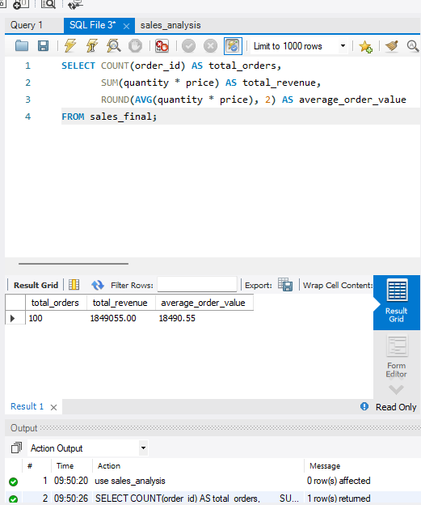
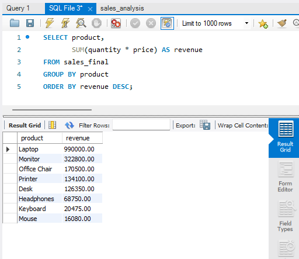
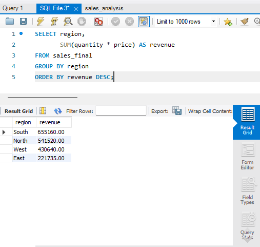

# Sales Data Analysis Using SQL

## Project Overview

This project analyzes sales data using MySQL to understand revenue, customer behavior, product performance, and regional sales.

The project was created as a beginner-level SQL portfolio project to practice SQL queries and answer practical business questions.

## Dataset

The dataset is a synthetic sales dataset containing 100 sales records from January to June 2025.

It includes information such as:

- Order ID
- Order Date
- Customer Name
- Product
- Category
- Region
- Quantity
- Price

A separate customer dataset contains:

- Customer Name
- City
- Age

## Tools Used

- MySQL
- MySQL Workbench
- SQL
- Excel
- GitHub

## SQL Concepts Used

- SELECT
- COUNT
- SUM
- AVG
- ROUND
- WHERE
- DISTINCT
- GROUP BY
- HAVING
- ORDER BY
- LIMIT
- CASE WHEN
- MONTH
- INNER JOIN
- Subqueries

## Business Questions

The project answers the following questions:

1. How many orders are in the dataset?
2. What is the total revenue?
3. What is the average order value?
4. Which products generate the most revenue?
5. Which category generates the most revenue?
6. Which region generates the most revenue?
7. Which customers generate the most revenue?
8. Which month generated the most revenue?
9. How many orders are High, Medium, and Low Value?
10. Which products were sold in the highest quantities?
11. How does category revenue change across different months?
12. Who are the top 5 customers by revenue?
13. Which 5 products generate the most revenue?
14. Which city generates the highest revenue?
15. Who are the top customers and which cities do they belong to?
16. Which customers generated more than ₹100,000 in revenue?
17. Which region has the highest number of orders?

## Key Findings

### Overall Performance

- Total Orders: **100**
- Total Revenue: **₹1,849,055**
- Average Order Value: **₹18,490.55**

### Product Performance

- **Laptop** generated the highest revenue at **₹990,000**.
- **Office Chair** had the highest quantity sold with **34 units**.

### Category Performance

- **Electronics** generated the highest revenue at **₹1,446,900**.
- Electronics contributed approximately **78% of total revenue**.

### Regional Performance

- **South** generated the highest revenue at **₹655,160**.
- South also had the highest number of orders with **40 orders**.

### Monthly Performance

- **April** generated the highest monthly revenue at **₹428,715**.
- **May** had the lowest monthly revenue at **₹219,315**.

### Customer Performance

- **Asha** was the highest-revenue customer with **₹373,605**.
- The top 5 customers were Asha, Amit, Sneha, Suresh, and Rohan.

### City Performance

- **Jaipur** generated the highest city-level revenue at **₹453,715**.

## Project Structure
```text
Sales-Data-Analysis-SQL
│
├── data
│   ├── sales_data.csv
│   └── customers_data.csv
│
├── screenshots
│   ├── 01_overall_performance.png
│   ├── 02_revenue_by_product.png
│   └── 03_revenue_by_region.png
│
├── sql
│   └── sales_analysis.sql
│
└── README.md
```
## How to Use This Project

1. Install MySQL and MySQL Workbench.
2. Create a database named `sales_analysis`.
3. Import `sales_data.csv` into a table named `sales_final`.
4. Import `customers_data.csv` into a table named `customers_final`.
5. Open `sql/sales_analysis.sql` in MySQL Workbench.
6. Connect the SQL editor to your MySQL server.
7. Run the queries to reproduce the analysis.

## Conclusion

The analysis shows that Electronics and Laptop sales are the major contributors to overall revenue.

The South region performed strongest in both revenue and order volume, while April was the strongest month.

The project demonstrates how SQL can be used to transform raw sales data into useful business insights.

## Note

The datasets used in this project are synthetic and were created for learning and portfolio purposes.

## Screenshots

### Overall Performance



### Revenue by Product



### Revenue by Region


